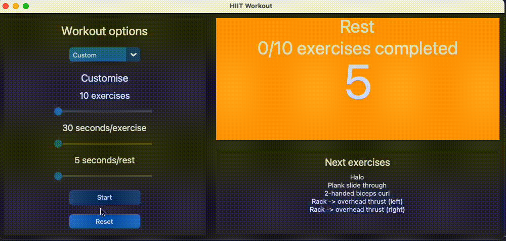

# HIIT app


This is a simple Tkinter app to help with HIIT/Kettlebell workouts. Possible exercises are stored in `src/data/exercises.json` and can be modified as desired. Saved workouts can be defined in `src/data/workouts.json` and loaded, or randomised workouts with custom durations used.

Here is an example of a custom workout whose exercises have been randomly selected:



## Installation

First, create a virtual environment with your preferred Python version (>=3.9):

```bash
python -m venv .venv
source .venv/bin/activate
```

Then run `make install` to install requirements and setup pre-commit hooks.

## Usage

Either `python src/app.py` or `make start`.

## Tests

Either `pytest tests` or `make test`.

## Building

To build the app as an exe or equivalent for your OS, run `make build`. The resulting artefact will be in the `dist` folder.
